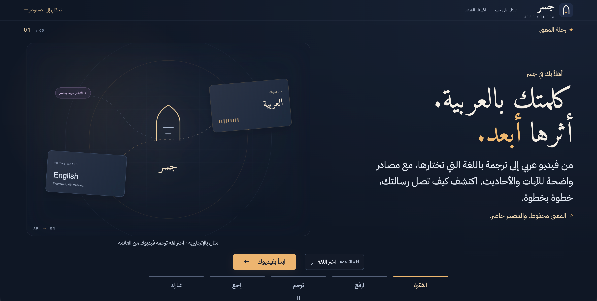
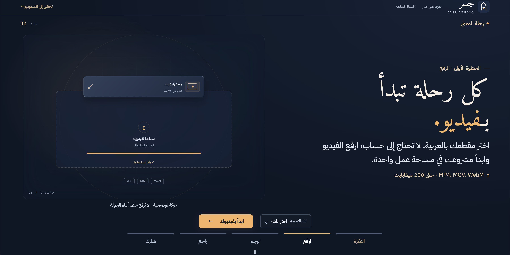
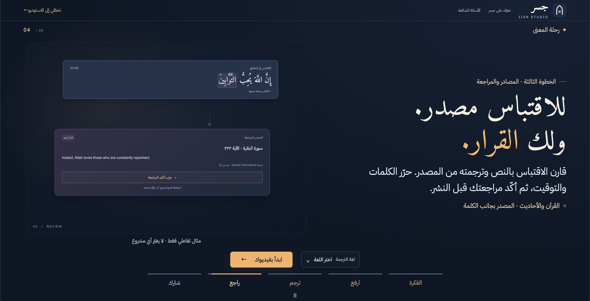
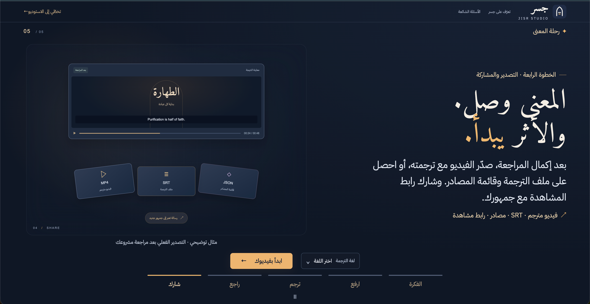
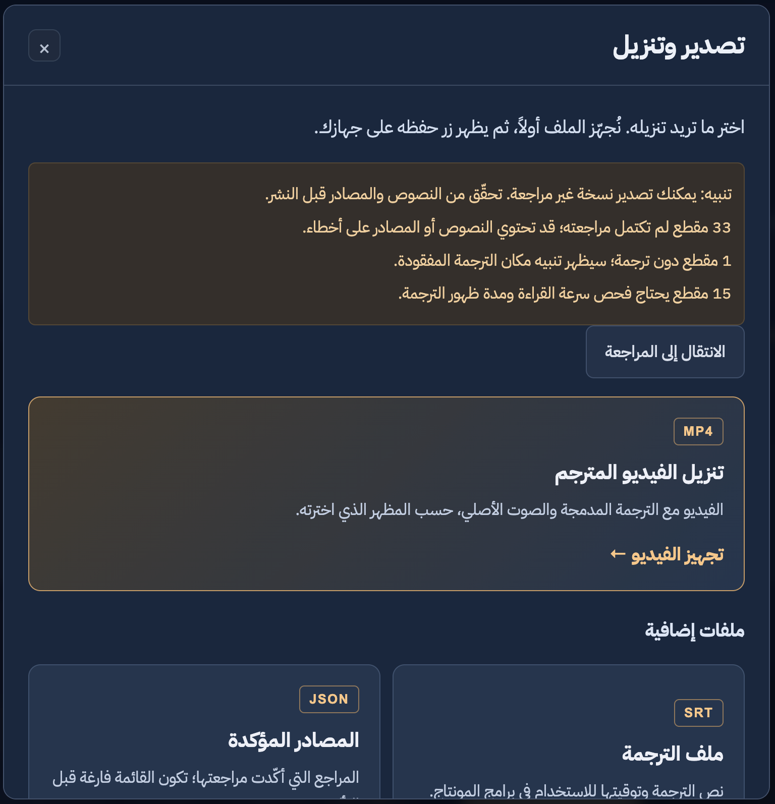
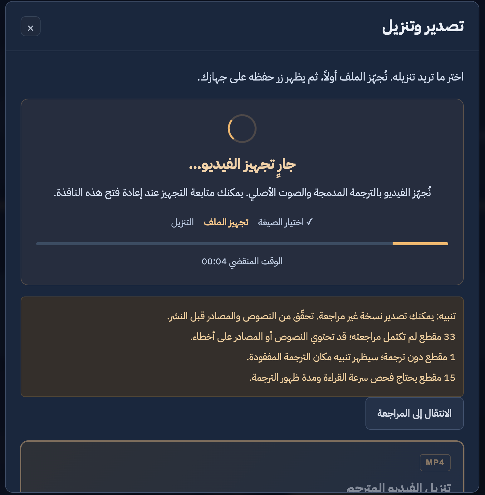
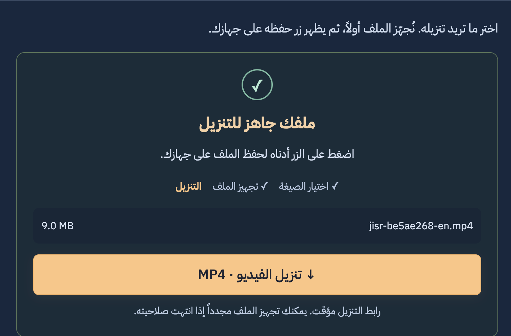
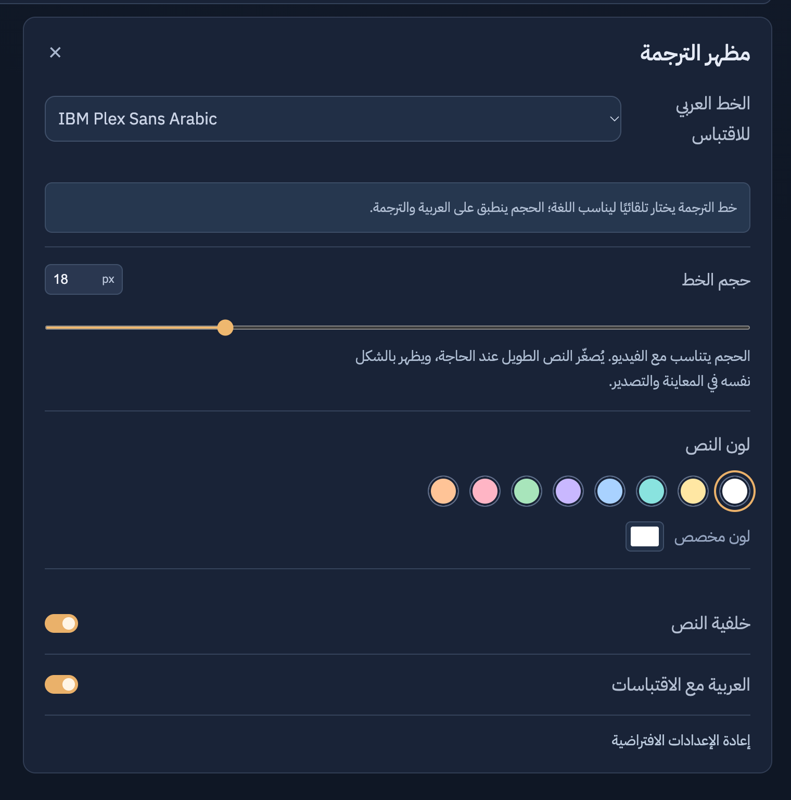
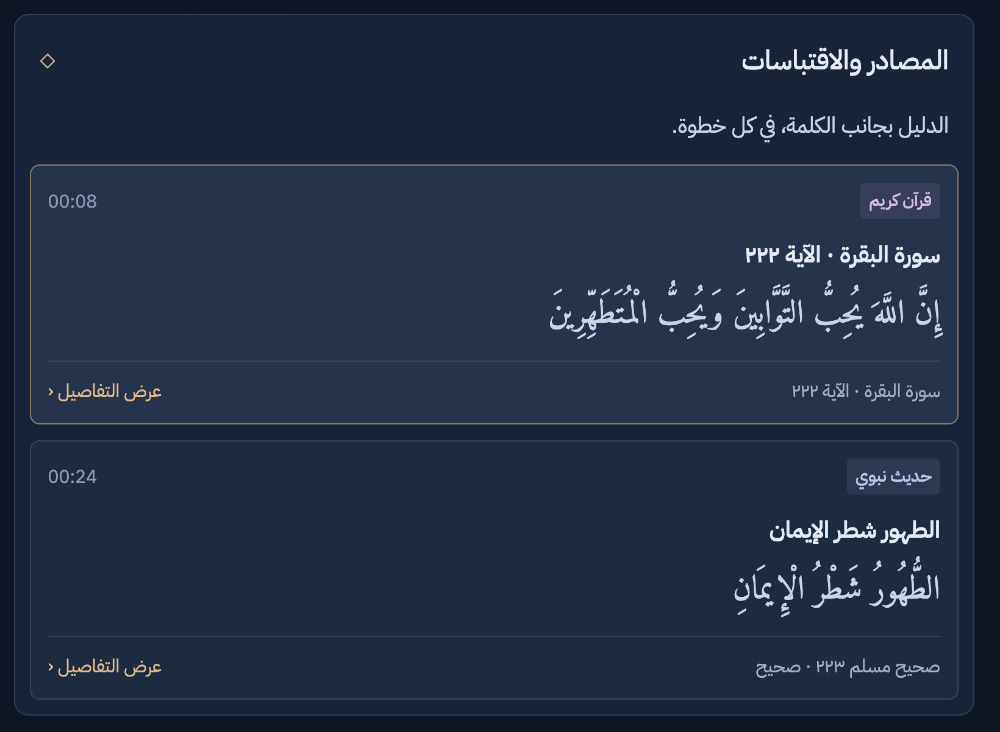

# JISR · جسر

<p align="center">
  
  
  
  
  
  
  
</p>

**An Arabic-first studio for translating Islamic videos into seven languages, with traceable Quran and Hadith references.**

منصة لترجمة الفيديو الإسلامي، ومراجعة النصوص، وتوثيق الاقتباسات في مساحة عمل واحدة.

**[Try the live demo](https://jisr-3ue4.onrender.com/) · [Explore the workflow](#how-it-works) · [Run locally](#run-locally)**

Built for the [AI Challenge for Serving Islamic Content](https://islamicaich.org/), October 2026.

## The problem

Sharing an Arabic Islamic video with a wider audience involves more than translating its words. Creators must transcribe speech, time subtitles, preserve religious terminology, check quoted verses and Hadith, and prepare the final video. Moving between separate tools makes the text, timing, and references harder to review together.

Jisr brings these tasks into one Arabic workspace for content creators and editors. Viewers receive translated subtitles; editors retain control of the wording and its sources.

## What makes Jisr useful

- **References beside the quotation:** inspect matched Arabic source text and available published translations without leaving the editor.
- **Clear translation provenance:** published source translations, machine drafts, and editor alternatives remain distinguishable. Missing translations are identified explicitly.
- **Human review before public sharing:** edit text and timing, inspect uncertain segments, and confirm the required checks before creating a public viewing link.
- **Seven target languages:** English, Spanish, Urdu, Hindi, Indonesian, Simplified Chinese, and Turkish, with script-specific fonts and RTL support for Urdu.
- **A connected editing and export workflow:** synchronize segment selection with playback, customize subtitles, and download MP4, SRT, or reference JSON.

Jisr assists translation and source review. It does not independently approve religious content or guarantee translation accuracy.

## How it works

1. **Choose a language and upload.** Language selection is required before choosing a video. No account is needed; a private edit link lets the creator return to the project.
2. **Transcribe and translate.** ElevenLabs Scribe v2 supplies Arabic word timestamps. OpenAI GPT-6 Luna drafts translations and assists with quotation detection, terminology, and meaning checks.
3. **Retrieve references.** Quranpedia, Dorar, and HadeethEnc provide source text and available published translations; Al-Jamhara supports terminology review.
4. **Review and edit.** Compare speech, text, timing, and source details. Confirm each segment and resolve the required citation checks.
5. **Export and share.** Download subtitled MP4, timed SRT, or confirmed references as JSON. Private drafts retain warnings; public viewing links require completed review.

Changing a processed project's language requires explicit confirmation. Retranslation reuses the Arabic transcription and timestamps, retains the Arabic reference identity, archives previous edits privately, and resets translation approvals and language-specific selections.

For detailed behavior, see the [review guide](docs/review-guide.md), [language and source coverage](docs/languages.md), and [export rendering guide](docs/export-rendering.md).

## 🖥️ Interface walkthrough

**Discover the idea → Upload → Transcribe and translate → Review sources → Export.**

The first five screens introduce the workflow through animated, illustrative scenes. The next two show the interactive example editor, where creators can explore the tools before uploading their own video. These screenshots use the English demonstration; uploaded projects use the selected target language. The silent example video and its sample text are separate demonstration assets. Additional screenshots show the appearance controls, source panel, and export menu. The export examples include an unreviewed project to show its warnings and preparation feedback; they are not evidence of approved content.

### 1. Introduction — share Arabic content across languages

The landing page introduces Jisr's purpose: helping Arabic Islamic video content reach audiences in the selected language with visible quotation sources. Its arch motif uses an English example. Visitors choose **لغة الترجمة**, then select **ابدأ بفيديوك** to upload; the five tour scenes advance every eight seconds, with a pause control and support for reduced motion. Upload begins only when the visitor chooses the start button.

<p align="center">
  
</p>
<p align="center"><sub>Arabic-first landing page · Animated brand illustration · Direct upload action</sub></p>

### 2. Upload — start with an Arabic video

The upload scene explains the starting point: choose a video and create a workspace without registering an account. It introduces the advertised MP4, MOV, and WebM formats and the 250 MB upload limit. The file card and progress line in this tour are explanatory animation; uploading begins when the visitor chooses a real file.

<p align="center">
  
</p>
<p align="center"><sub>Choose a video · No account required · One connected workspace</sub></p>

### 3. Transcription and translation — from sound to a timed draft

The translation scene shows how speech becomes Arabic text and an English draft associated with video timing. In a real project, word timestamps guide the subtitle boundaries, while quotation candidates and terminology are prepared for review. The output remains editable so the creator can check the connected meaning before approving it.

<p align="center">
  
</p>
<p align="center"><sub>Audio waveform → Timed Arabic transcript → Editable English draft</sub></p>

### 4. Sources and review — keep the reference beside the quotation

The review scene connects a spoken Quran excerpt to its reference and corresponding English translation. Creators compare the wording, inspect the source, and confirm the result themselves. Its sample confirmation is interactive within the tour and does not approve a real project. The current editor places **راجعت هذا المقطع** directly on each segment card.

<p align="center">
  
</p>
<p align="center"><sub>Quotation → Reference → Corresponding translation → Human confirmation</sub></p>

### 5. Export and sharing — deliver the translated result

The export scene introduces the finished video and subtitle-file outputs. Real projects support MP4 with embedded subtitles, timed SRT, and JSON reference lists. Private drafts retain review warnings; the public viewing link requires the review confirmations. Published source translations and machine drafts remain distinguishable throughout the workflow.

<p align="center">
  
</p>
<p align="center"><sub>Subtitled MP4 · Timed SRT · Reference JSON · Viewing link after review</sub></p>

#### Export menu and download feedback

The export menu makes **MP4 video** the primary choice, with **SRT subtitles** and **confirmed reference JSON** as separate options. Draft references sit in an expandable section, while public sharing has its own review requirements.

1. **Choose an output.** MP4 uses the selected subtitle appearance and preserves the original audio.
2. **Follow preparation.** An animated status panel shows that rendering is underway and displays elapsed time. Export choices are disabled while preparation runs.
3. **Download the ready file.** The panel shows the filename and file size, followed by a clear download button. After clicking, the user is directed to the browser’s Downloads to follow the transfer; the button remains available to download again.

Failed preparation offers a retry, and an expired download link asks the user to prepare the file again. Animations respect reduced-motion preferences. Project edit-link and deletion controls are grouped in a separate expandable section to keep the download choices easy to scan.

<details>
<summary>View the export menu and rendering feedback</summary>

<p align="center">
  
</p>
<p align="center"><sub>MP4 as the primary action · Review warnings · Additional output formats</sub></p>

<p align="center">
  
</p>
<p align="center"><sub>Preparation status · Elapsed time · Review warnings remain visible</sub></p>

<p align="center">
  
</p>
<p align="center"><sub>File ready · Filename and size · Explicit MP4 download action</sub></p>

</details>

### 6. The studio — preview, edit, and review together

The studio brings the project title, workflow stages, video preview, and segment list into one view. The English example shows Arabic text beside its translation; filters help creators find Quran, Hadith, and segments needing review. Selecting a segment seeks to its position in the video, making it easier to compare the subtitle with what was spoken.

<p align="center">
  
</p>
<p align="center"><sub>Project controls · Workflow status · Arabic and English segment editor · Video preview</sub></p>

The detailed view shows the numbered cue timeline and the **المراجعة**, **المصادر**, and **المظهر** tool tabs. Creators can open reference details, adjust subtitle appearance, and review individual segments. The highlighted cue ties the editor to playback; source labels keep references visible beside the relevant text.

<p align="center">
  
</p>
<p align="center"><sub>Linked cues and playback · Source labels · Review, source, and appearance tools</sub></p>

### 7. Subtitle appearance

Adjust the Arabic quotation font, subtitle size, text color, backdrop, and whether Arabic quotations accompany the translation. The target-language font is selected automatically for script coverage. Real-project preview and MP4 use the same rendered subtitle images.

<p align="center">
  
</p>
<p align="center"><sub>Font and size · Text color · Backdrop · Arabic quotation visibility</sub></p>

### 8. Sources and quotations

The source panel gathers Quran and Hadith references beside their cue times. Open a card to inspect its details and compare the quotation with the source. The screenshot uses the illustrative demo references; actual projects display the references retrieved for their own content.

<p align="center">
  
</p>
<p align="center"><sub>Timed quotation cards · Reference identity · Source details</sub></p>

## 🎨 Design system

Jisr offers a dark navy theme and a dim slate alternative theme, both with warm gold accents. The header theme switch remembers the visitor’s choice. Navy provides a consistent background for the video and editing workspace; gold highlights primary actions, the active workflow step, and selected controls. Light text and distinct panel borders keep content readable. The interface supports RTL Arabic/Urdu and LTR text in the other target languages, with bundled script fonts.

| Preview | Color | Hex | Purpose |
|---|---|---|---|
|  | Deep navy | `#101725` | Main website background |
|  | Slate navy | `#1A2436` | Project panels and layered surfaces |
|  | Warm gold | `#EFB86F` | Primary actions, progress, and focus indicators |
|  | Soft white | `#EDF0F7` | Main interface text |
|  | Muted blue-gray | `#929CB1` | Supporting text |
|  | Slate border | `#303B51` | Panel borders and separators |
|  | Logo navy | `#202C46` | Rounded logo tile |
|  | Logo ivory | `#F5F3ED` | Arch and upper horizontal stroke |
|  | Logo gold | `#EEB66B` | Lower horizontal stroke |


The logo is an arch-shaped mark with two horizontal strokes, reflecting Jisr's name, **جسر** (bridge), and its connection between Arabic content and audiences across languages. Its rounded navy tile uses `#202C46`, the arch uses ivory `#F5F3ED`, and the lower stroke uses gold `#EEB66B`. The same mark appears in the header and browser favicon.

**Typography:** IBM Plex Sans Arabic for interface text and controls; Amiri for expressive Arabic headings. Motion illustrates the workflow and responds to processing activity, with reduced-motion support.

**Technology:** the frontend uses HTML, CSS, and vanilla JavaScript; the backend uses Python's standard-library HTTP server and SQLite. FFmpeg handles media and subtitle rendering, and Docker packages the application for deployment.

## 🧱 Project structure

```text
JISR/
├── README.md                    # Overview, design system, setup, and verification
├── server.py                    # HTTP API, AI pipeline, SQLite storage, and exports
├── pipeline_quality.py          # Meaning checks, reading warnings, Hadith grouping
├── subtitle_png.py              # PNG alpha bounds for fitting subtitle images
├── dist/                        # Active frontend; served directly without a build step
│   ├── index.html               # Arabic RTL landing page and studio shell
│   ├── favicon.svg              # Jisr arch logo
│   ├── demo.mp4                 # Silent illustrative interface example
│   ├── languages.json           # Shared language/source/font/caption policy
│   ├── source-caption-labels.json # Shared English chapter names and caption labels
│   ├── css/
│   │   ├── style.css            # Base layout and controls
│   │   ├── studio.css           # Dark editor theme and processing panel
│   │   ├── landing.css          # Landing-page presentation
│   │   ├── onboarding.css       # Animated introduction and tour scenes
│   │   ├── readability.css      # Typography, responsive layout, workflow animation
│   │   └── fonts.css            # Bundled font declarations
│   ├── js/
│   │   ├── languages.js         # Language catalog, direction, and font policy
│   │   ├── language-picker.js   # Themed, keyboard-accessible language menus
│   │   ├── app.js               # Project state, API calls, editing, review, exports
│   │   ├── studio.js            # Workspace tools, timeline, processing details
│   │   ├── onboarding.js        # Automatic tour, navigation, and motion controls
│   │   ├── citation-text.js     # Source text, captions, review eligibility
│   │   ├── citation-links.js    # Citation-link presentation
│   │   ├── subtitle-preview.js  # Subtitle image loading, cache, and cue timing
│   │   └── splash.js            # Optional introductory splash implementation
│   └── fonts/                   # Arabic, Urdu, Hindi, Chinese and Latin fonts + OFL notices
├── languages.py                 # Allowlist, per-job language context, legacy migration
├── tests/                       # Python integration/regression and JavaScript checks
├── scripts/
│   ├── check_deployment.py      # Hosted application and asset smoke checks
│   ├── check_sources.py         # Public source-service checks
│   ├── refresh_source_links.py  # Repair saved citation links
│   ├── package_source.py        # Package source, tests, and documentation
│   └── package_demo.py          # Build a runtime-only deployment package
├── docs/
│   ├── design/colors/           # README color-preview assets
│   ├── previews/                # Interface screenshots
│   ├── hackathon/               # Organizer guide, template, and source package
│   ├── team-preparation/        # Presentation, video, evaluation, and task drafts
│   └── *.md                     # Contracts, source policy, deployment, verification
├── submission/                  # Submission working folders and release materials
├── .vscode/                     # Editor, run, debug, and test configuration
├── .env.example                 # Configuration template without credentials
├── Dockerfile                   # Deployment image with FFmpeg
├── docker-entrypoint.py         # Container startup
├── render.yaml                  # Free Render demo configuration
├── compose.yaml                 # App, Caddy proxy, and persistent data volume
├── Caddyfile                    # Reverse-proxy configuration
├── data/                        # Generated media and SQLite database; Git-ignored
└── archive/prototype/           # Preserved early frontend and FastAPI prototype
```

- **Frontend:** HTML, CSS, and vanilla JavaScript handle the landing experience, video preview, review controls, and editing tools.
- **Backend:** `server.py` coordinates transcription, translation, source retrieval, storage, and exports.
- **Quality and rendering:** `pipeline_quality.py` checks cue meaning/readability; FFmpeg renders the subtitle images and final video, with `subtitle_png.py` supporting image fitting.
- **Verification and delivery:** `tests/`, `scripts/`, and `docs/` cover reproducible checks, deployment preparation, and documented limitations.

The active backend is `server.py`; the archived FastAPI prototype is not the running application. See the [code map](docs/code-map.md) and [API/data contract](docs/data-contract.md).

## Run locally

Requirements: **Python 3.11+** and **FFmpeg with libass and libx264** for video inspection, audio-gap detection, subtitle preview, and MP4 export. No Python package installation or frontend build is needed.

Copy the configuration template:

```bash
# macOS / Linux
cp .env.example .env
```

```powershell
# Windows PowerShell
Copy-Item .env.example .env
```

Add your keys to `.env`:

```dotenv
ELEVENLABS_API_KEY=your_elevenlabs_key
OPENAI_API_KEY=your_openai_key
OPENAI_MODEL=gpt-6-luna
```

The ElevenLabs key must have **Speech to Text** access. If FFmpeg is not in `PATH`, set `FFMPEG_PATH` to its executable in `.env`.

```bash
python server.py
```

Open [http://127.0.0.1:8766](http://127.0.0.1:8766). On systems where Python is named `python3`, use that command instead. Restart the server after changing `.env`.

The interactive demo and manual transcript workflow can be used without AI keys. Automatic processing requires both keys and access to the source services. `/api/health` reports configuration availability; it does not verify credentials, billing, or model access.

In VS Code, select a Python interpreter and use **Run and Debug → JISR: Debug app**. The supplied tasks use `python3` on macOS/Linux and `python` on Windows.

## Sources and services

| Content or task | Source or service |
|---|---|
| Speech and word timestamps | [ElevenLabs Scribe v2](https://elevenlabs.io/docs/api-reference/speech-to-text/convert) |
| Ordinary-speech translation and quotation detection | [OpenAI GPT-6 Luna](https://developers.openai.com/api/docs/models/gpt-6-luna) through the Responses API |
| Quran text | [Quranpedia API](https://quranpedia.net/api-docs), Hafs text |
| Quran meanings translations | Seven verified language codes/books; English defaults to Saheeh International `1947`; see [coverage](docs/languages.md) |
| Quran explanation, when available | [Dorar tafsir](https://dorar.net/tafseer), preserving section scope and references |
| Hadith attribution and grading candidates | [Dorar](https://dorar.net/hadith) |
| Matched Hadith translation and explanation | [HadeethEnc API](https://github.com/islamhouse-dev/hadith-api) |
| Islamic terminology | [Al-Jamhara dictionary](https://islamic-content.com/dictionary), retrieved for detected terms |
| Subtitle rendering and MP4 export | FFmpeg |

Religious explanations are retrieved from their sources, not generated by the model. Dorar and HadeethEnc metadata remain distinguishable when both are attached. A source's Hadith grade is not an AI confidence score.

See the [source policy](docs/source-policy.md) for the mapping to the challenge's scientific package and remaining source-integration limits, including QuranEnc prioritisation. Third-party services and content have their own licenses and terms. This repository does not bundle religious datasets, model weights, or API credentials; the demo content is illustrative.

## Validation

Recorded provider runs cover real Arabic-video transcription, translation, and export. Automated multilingual checks cover upload, language persistence, retranslation, review, sharing, Unicode SRT, script fonts, and actual FFmpeg rendering. Browser checks also cover editing and native downloads.

| Evidence | What it establishes |
|---|---|
| [Provider verification](docs/verification-2026-10-05.md) | Six real Arabic videos processed and exported with the configured providers |
| [Processing and export verification](docs/verification-2026-10-06.md) | Additional processing, MP4/SRT exports, and browser downloads |
| [Multilingual verification](docs/verification-multilingual-2026-10-06.md) | Seven-language workflow and rendering checks using mocked AI/source responses and actual local FFmpeg |
| [Browser verification](docs/verification-2026-10-04.md) | Earlier desktop/mobile onboarding, editing, appearance, and download checks |

These reports describe the versions and environments tested. They do not establish native-language religious review, whole-corpus source coverage, or the current state of the live deployment.

See the [maintenance guide](docs/maintenance.md) for public-source checks and saved-project link repairs.

Run the local checks:

```bash
python -m unittest discover -s tests -v
node tests/test_citation_links.js
node tests/test_citation_text.js
node tests/test_subtitle_preview.js
node tests/test_languages.js
```

## Privacy and limitations

- **Human judgment remains essential.** Uncertain speech, fast subtitles, source matching, and machine translation require review. Paid multilingual translation accuracy has not yet been evaluated across all seven languages by native-language religious reviewers.
- **Published translations vary by record.** A supported language does not guarantee a translation for every reference. Unavailable translations are labelled; machine or editor alternatives are not presented as published source text.
- **Processing uses external services.** Uploaded media is sent to ElevenLabs; transcript and translation context is sent to OpenAI. Responses requests use `store: false`, and each provider's data policies still apply. Source lookups send relevant quotation or terminology queries.
- **Edit links are private credentials.** There are no accounts or backup system. Keep edit links and API keys private. The public viewer provides read-only access.
- **The free demo has temporary storage.** Projects and viewing links may be lost on service sleep, restart, or redeployment. A separately configured deployment can use persistent storage. On persistent storage, project data remains until the editor deletes it; there is no automatic project expiry.
- **Media and hosting limits apply.** Uploads are limited to 250 MB. Free hosting may need time to wake up, and automatic processing incurs provider charges. SRT appearance depends on the receiving player; MP4 embeds the rendered subtitles.

`.env`, generated media, project databases, logs, and Python caches are excluded from Git. Only `.env.example` is intended for publication.

## Deployment

The [live demo](https://jisr-3ue4.onrender.com/) uses Render. `render.yaml` enables deployment on commits for Blueprint-managed services. Existing services must also have **Auto-Deploy → On Commit** enabled in the Render dashboard; otherwise deploy the latest commit manually.

A GitHub push does not itself confirm successful deployment. Verify the live release before demonstrating it:

```bash
python scripts/check_deployment.py https://jisr-3ue4.onrender.com/
```

The check verifies health and required frontend assets without uploading media or invoking paid AI. A complete live processing/review/export check is still needed to validate the deployed workflow.

See the [deployment guide](docs/deployment.md) for hosting, persistent storage, and clean source/runtime packaging, and the [implementation status](docs/implementation-status.md) for remaining launch checks.

## Team

- **Turki:** frontend, UI/UX, integration, and export.
- **Anas:** AI engineering, translation, and API integration.
