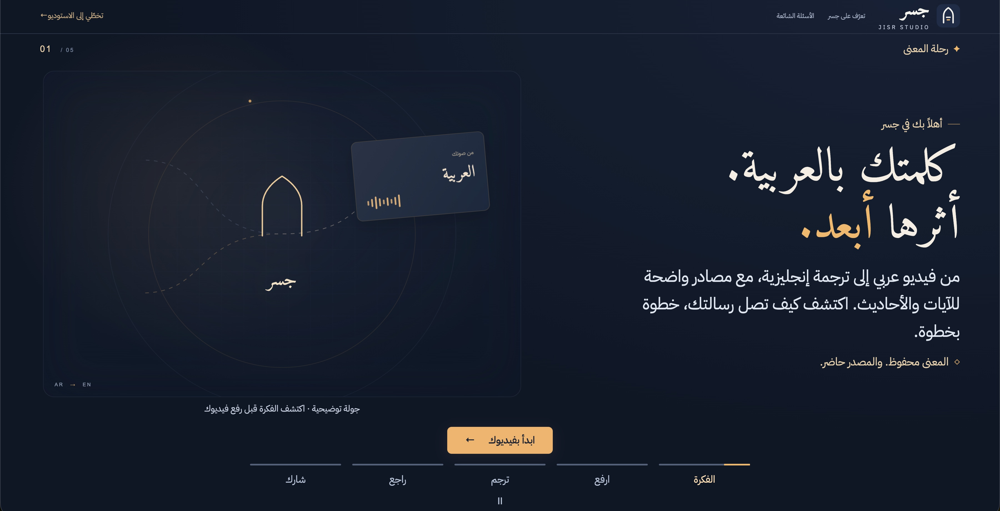
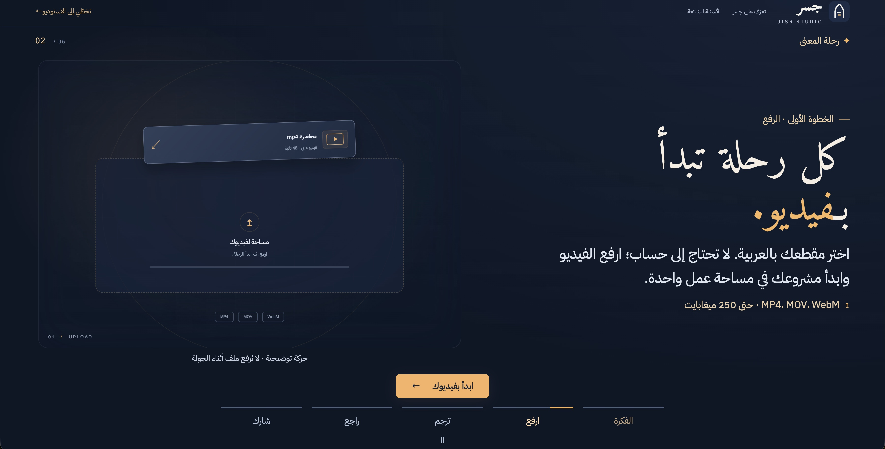
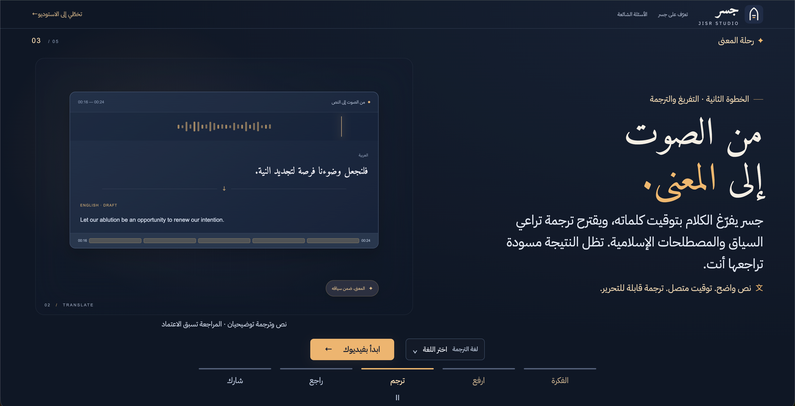
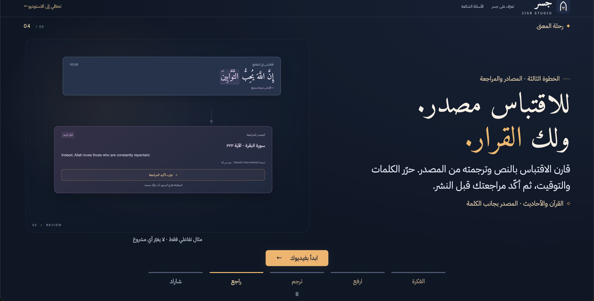
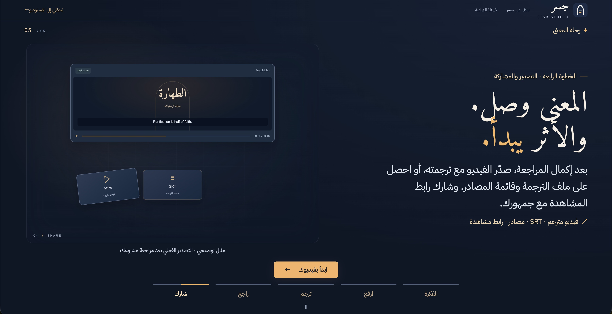
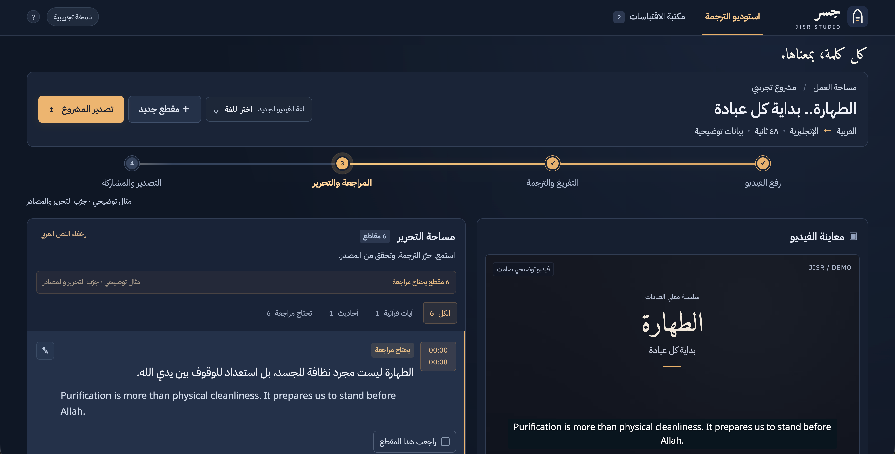
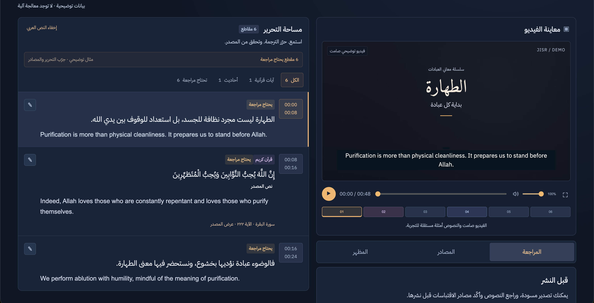

# JISR · جسر

<p align="center">
  
  
  
  
  
  
  
</p>

**Smart studio for translating Arabic Islamic videos into seven target languages, with documented Quranic and Hadith citations.**  
منصة ذكية لترجمة الفيديو الإسلامي وتوثيق الآيات القرآنية والأحاديث النبوية.

> Built for the [AI Challenge for Serving Islamic Content](https://islamicaich.org/), October 2026.  
> Jisr is an AI-assisted tool. Private SRT/MP4 drafts can be exported with a review warning. Every matched Quranic or Hadith citation requires human confirmation before sharing through a public viewing link.

**Current status:** The local application integrates **ElevenLabs Scribe v2** for transcription and **OpenAI GPT-6 Luna** for translation, quotation detection, terminology review, independent meaning checks, and source-excerpt alignment. Six real Arabic videos were processed and exported locally with the actual providers. Expert content review and deployment verification of the current release remain necessary before launch. See the [October 5 verification](docs/verification-2026-10-05.md).

The [October 6 product check](docs/verification-2026-10-06.md) verified fresh
local processing, eight current-renderer MP4 exports, browser downloads and a
fresh MP4/SRT workflow on the existing Render host. Automatic Hadith matching
now rejects punctuation-only attribution values. The hosted version is older
than the local release; publish the current fixes before demonstrating its
latest subtitle appearance. Fast cues and unsourced Hadith English remain
explicit human-review tasks.

The [October 4 verification](docs/verification-2026-10-04.md) records 111 passing
Python tests and desktop/mobile browser checks for onboarding, appearance,
upload, review and native MP4 download.

## Translation languages

Choose **لغة الترجمة** beside the upload control before selecting a video: English (`en`, default), Spanish (`es`), Urdu (`ur`, RTL), Hindi (`hi`), Indonesian (`id`), Simplified Chinese (`zh-Hans`) or Turkish (`tr`). The saved project keeps its language when reopened. The editor remains Arabic.

To change a processed project, choose a different project language and click **إعادة الترجمة**, then confirm. This reuses the Arabic transcription and word timestamps, preserves the Arabic reference identity, saves the previous edits in a private language history, and clears translation approval/selections/custom source captions. It does not call ElevenLabs again. The configured translation provider handles speech, terminology, meaning review and exact source-excerpt alignment in the selected language.

Published Quran/Hadith translations are fetched in that language; absent or failed source responses show **لا تتوفر ترجمة موثقة بهذه اللغة**. A speech draft never becomes a sourced translation or silently falls back to English. Matching Arabic and human acceptance remain separate from translation availability. An editor can review an explicitly labelled alternative; this does not turn it into a published source translation.

[Language/source coverage](docs/languages.md) documents verified provider codes, selected Quran books, per-record availability, Chinese script mapping and font licenses. The seven-language source catalog/sample check used free public APIs; AI tests use mocks. No paid multilingual model trial has been performed.

Preview and MP4 use the same shaped subtitle images, script fonts, fitted size and timing. SRT carries Unicode and timing; its appearance depends on the subtitle player. Language is included in quality hashes, source caches, preview images, MP4 manifests and download filenames. Legacy projects migrate to English with their texts, manual changes and reviews retained.

## 🖥️ Interface walkthrough

**Discover the idea → Upload → Transcribe and translate → Review sources → Export.**

The first five screens introduce the workflow through animated, illustrative scenes. The final two show the interactive example editor, where creators can explore the tools before uploading their own video. These screenshots use the English demonstration; uploaded projects use the selected target language. The silent example video and its sample text are separate demonstration assets.

### 1. Introduction — a bridge from Arabic to English

The landing page introduces Jisr's purpose: helping Arabic Islamic video content reach audiences in the selected language with visible quotation sources. Its arch motif uses an English example. Visitors choose **لغة الترجمة**, then select **ابدأ بفيديوك** to upload; the five tour scenes advance every eight seconds, with a pause control and support for reduced motion. Upload begins only when the visitor chooses the start button.

<p align="center">
  
</p>
<p align="center"><sub>Arabic-first landing page · Animated brand illustration · Direct upload action</sub></p>

### 2. Upload — start with an Arabic video

The upload scene explains the starting point: choose a video and create a workspace without registering an account. It introduces the advertised MP4, MOV, and WebM formats and the 250 MB upload limit. The file card and progress line in this tour are explanatory animation; uploading begins when the visitor chooses a real file.

<p align="center">
  
</p>
<p align="center"><sub>Choose a video · No account required · One connected workspace</sub></p>

### 3. Transcription and translation — from sound to a timed draft

The translation scene shows how speech becomes Arabic text and an English draft associated with video timing. In a real project, word timestamps guide the subtitle boundaries, while quotation candidates and terminology are prepared for review. The output remains editable so the creator can check the connected meaning before approving it.

<p align="center">
  
</p>
<p align="center"><sub>Audio waveform → Timed Arabic transcript → Editable English draft</sub></p>

### 4. Sources and review — keep the reference beside the quotation

The review scene connects a spoken Quran excerpt to its reference and corresponding English translation. Creators compare the wording, inspect the source, and confirm the result themselves. Its sample confirmation is interactive within the tour and does not approve a real project. The current editor places **راجعت هذا المقطع** directly on each segment card.

<p align="center">
  
</p>
<p align="center"><sub>Quotation → Reference → Corresponding translation → Human confirmation</sub></p>

### 5. Export and sharing — deliver the translated result

The export scene introduces the finished video and subtitle-file outputs. Real projects support MP4 with embedded subtitles, timed SRT, and JSON reference lists. Private drafts retain review warnings; the public viewing link requires the review confirmations. Published source translations and machine drafts remain distinguishable throughout the workflow.

<p align="center">
  
</p>
<p align="center"><sub>Subtitled MP4 · Timed SRT · Reference JSON · Viewing link after review</sub></p>

#### Export menu and download feedback

The export menu makes **MP4 video** the primary choice, with **SRT subtitles** and **confirmed reference JSON** as separate options. Draft references sit in an expandable section, while public sharing has its own review requirements.

1. **Choose an output.** MP4 uses the selected subtitle appearance and preserves the original audio.
2. **Follow preparation.** An animated status panel shows that rendering is underway and displays elapsed time. It does not invent a completion percentage, and export choices are disabled while preparation runs.
3. **Download the ready file.** The panel shows the filename and file size, followed by a clear download button. After clicking, the user is directed to the browser’s Downloads to follow the transfer; the button remains available to download again.

Failed preparation offers a retry, and an expired download link asks the user to prepare the file again. Animations respect reduced-motion preferences. Project edit-link and deletion controls are grouped in a separate expandable section to keep the download choices easy to scan.

### 6. The studio — preview, edit, and review together

The studio brings the project title, workflow stages, video preview, and segment list into one view. Arabic text and English translations appear together; filters help creators find Quran, Hadith, and segments needing review. Selecting a segment seeks to its position in the video, making it easier to compare the subtitle with what was spoken.

<p align="center">
  
</p>
<p align="center"><sub>Project controls · Workflow status · Arabic and English segment editor · Video preview</sub></p>

The detailed view shows the numbered cue timeline and the **المراجعة**, **المصادر**, and **المظهر** tool tabs. Creators can open reference details, adjust subtitle appearance, and review individual segments. The highlighted cue ties the editor to playback; source labels keep references visible beside the relevant text.

<p align="center">
  
</p>
<p align="center"><sub>Linked cues and playback · Source labels · Review, source, and appearance tools</sub></p>

## 🎨 Design system

Jisr uses a dark navy theme with warm gold accents. Navy provides a consistent background for the video and editing workspace; gold highlights primary actions, the active workflow step, and selected controls. Light text and distinct panel borders keep content readable. The interface supports RTL Arabic/Urdu and LTR text in the other target languages, with bundled script fonts.

| Preview | Color | Hex | Purpose |
|---|---|---|---|
|  | Deep navy | `#101725` | Main website background |
|  | Slate navy | `#1A2436` | Project panels and layered surfaces |
|  | Warm gold | `#EFB86F` | Primary actions, progress, and focus indicators |
|  | Soft white | `#EDF0F7` | Main interface text |
|  | Muted blue-gray | `#929CB1` | Supporting text |
|  | Slate border | `#303B51` | Panel borders and separators |
|  | Logo navy | `#202C46` | Rounded logo tile |
|  | Logo ivory | `#F5F3ED` | Arch and upper horizontal stroke |
|  | Logo gold | `#EEB66B` | Lower horizontal stroke |


The logo is an arch-shaped mark with two horizontal strokes, reflecting Jisr's name, **جسر** (bridge), and its connection between Arabic content and English-speaking audiences. Its rounded navy tile uses `#202C46`, the arch uses ivory `#F5F3ED`, and the lower stroke uses gold `#EEB66B`. The same mark appears in the header and browser favicon.

**Typography:** IBM Plex Sans Arabic for interface text and controls; Amiri for expressive Arabic headings. Motion illustrates the workflow and responds to processing activity, with reduced-motion support.

**Technology:** the frontend uses HTML, CSS, and vanilla JavaScript; the backend uses Python's standard-library HTTP server and SQLite. FFmpeg handles media and subtitle rendering, and Docker packages the application for deployment.

## The problem

Islamic organizations produce valuable Arabic videos, but reaching viewers in other languages requires transcription, subtitle timing, translation, and manual verification of every quoted verse or Hadith. Transcription errors can slip through, quotations can be translated as ordinary speech, and viewers may receive no traceable sources.

## How it works

1. **Upload** an Arabic video with a selected target language, or open the English interactive example.
2. **Transcribe** with Scribe v2 word timestamps. Suspected audio gaps and uncertain speech are flagged for correction.
3. **Translate** ordinary speech into the selected language with GPT-6 Luna. Word-range validation preserves the transcript and timing; a separate bounded check looks for meaning borrowed from neighboring cues, repetition, ambiguous transcription, and religious terminology errors. Al-Jamhara definitions guide translation of detected Islamic terms. Both automatic translation and its check remain drafts until human review.
4. **Verify Quran quotations** against Quranpedia's Hafs text and attach the selected language's published meanings translation. The model does not generate canonical verse translations.
5. **Verify Hadith quotations** against Dorar and search HadeethEnc for a matching translation. Connected quotation parts are retrieved together and keep one source identity. Short search anchors recover records missed by full queries. A unique complete match can be attached automatically; competing narrations appear for comparison. Explanation availability is separate from translation availability. Unverified target-language translations remain labelled drafts, independently of Arabic reference verification.

Hadith retrieval prioritizes matching the spoken wording over filling metadata: a record with an unspecified narrator stays explicitly incomplete rather than being replaced by a different narration. Conditional wording and pronouns are checked separately from general fuzzy similarity. Long quotations also follow subtitle length limits; existing Arabic/target-language sentence clauses can be split locally when their counts agree, preserving every timed word and remaining unconfirmed. Otherwise, word-range translation repartitions them before group retrieval. Human edits and approvals are preserved.
6. **Review** source Arabic and target-language text, timing, narrator, grading, attribution, and subtitle appearance. The editor displays matched Quran/Hadith wording from the reference and keeps the original transcript available for comparison. Saving that wording unchanged preserves the reference; changing quotation text invalidates the link and requires verification again.
7. **Export** a subtitled MP4 or SRT draft with warnings, a JSON list of confirmed citations, or a separate private draft-source inventory with review states and suggestions. The confirmed list is empty before citations are accepted. Public read-only video links require every segment to be reviewed. Exporting a draft does not confirm its text or sources.

For partial quotations, citation details retain the full source while subtitles use the corresponding Arabic and target-language excerpt. The model can select an exact substring from that language's published translation; it cannot invent a canonical translation or reuse an English span for another language. Uncertain published-text alignment requires manual selection before confirmation and public sharing. A private draft never substitutes an unresolved partial quotation with the full reference. Missing published translations use the explicitly labelled alternative policy described above.

Source, translation, explanation, and search links are displayed separately. A Dorar direct link is used only when the published record matches the full text and attribution metadata. If no unique record can be resolved, the interface explicitly labels the search fallback.

## Reviewing citations and subtitle source lines

- **Canonical Arabic:** literal Quran/Hadith quotations use the matched source excerpt in the segment list, edit dialog, source cards, and Arabic video preview. When it differs from speech recognition, expand **التفريغ الأصلي** in the edit dialog to compare the original transcript. Partial quotations use their selected excerpt; unresolved excerpts are not replaced by the full reference.
- **Human confirmation:** all unreviewed segments, including ordinary speech, appear in the review filter. A successful machine check never sets human approval. Check wording, meaning, translation, and attribution before selecting **راجعت هذا المقطع**. Unmatched citations remain flagged, with a message distinguishing no match, service unavailability, and an invalid response.
- **Meaning and reading warnings:** ambiguous extraction, duplicated meaning and correction warnings appear beside the affected cue. Language-specific character/second heuristics flag fast text or a display shorter than one second; Chinese counts characters rather than space-separated words. They do not stretch word timings or shorten canonical source translations. Listen and edit these cues before confirming; metrics remain available after confirmation.
- **Retry saved projects:** when the backend reports remaining automatic checks or source work, **إعادة فحص المعنى والمصادر** is available even for a ready project. It reuses saved transcription and completed checks; reviewed text, human translations and custom source captions are protected.
- **Connected Hadith source selection:** use **قارن واربط** to compare complete Arabic/target-language records, narrator, grade and attribution. For a connected quotation, **تطبيق المرجع على أجزاء الاقتباس المتصل** applies the selected record to the group together. Different wording requires the explicit paraphrase option. Group updates protect reviewed text, human translations and custom source captions.
- **Audience labels:** automatic Quran captions identify a translation of Quranic meanings and its translator in the target language. Missing published translations, machine drafts and editor alternatives have separate localized labels in preview and exports. Custom or hidden captions remain the editor's responsibility.
- **Hadith paraphrases:** editors can explicitly link a related Hadith as **نقل بالمعنى**. By default this preserves the speaker's wording and its translation. In the edit dialog, **استخدام نص المرجع وترجمته في الفيديو** switches to the corresponding source Arabic excerpt and an exact substring selected from the published target-language translation. Original speech and timings remain intact; the source line identifies source wording and a related narration in the target language. Switching modes clears approval; partial published source wording requires a selected translated excerpt. This editor operation makes no AI requests.
- **Suggested Hadith sources:** if Dorar cannot match a quotation literally, a bounded HadeethEnc search uses short Arabic anchors. Complete records are checked again; abbreviated wording and recognition differences appear under **مصدر محتمل · قارن واربط**, showing source Arabic, available target-language translation, narrator, grading, and attribution. These suggestions are not verified literal quotations. Selecting **ربط كنقل بالمعنى** preserves spoken text and leaves human review pending.
- **Readable cues:** the translator aims for short connected clauses. Per-language character limits are configured in `dist/languages.json`; Chinese uses a 70-character limit. Overlong translation parts, or parts over 8 seconds with more than 12 Arabic words, allow one repair attempt. Original word timestamps remain authoritative. Retrying an older project can repair oversized unreviewed speech or Hadith without retranscribing or changing reviewed quotations; failed repair preserves existing translations. Religious quotations retain their separate source-matching rules and cannot be shortened by dropping source words.
- **Editable source caption:** select a Quran/Hadith segment, then click **تعديل سطر المصدر** above the video preview, or edit **سطر المصدر أسفل الترجمة** in the segment dialog. Save a custom single-line caption of up to 200 characters, leave it empty to hide the line, or choose **استعادة السطر الأصلي** to restore the automatic label.

Source-caption changes persist after reloading and appear in the preview, MP4, and SRT exports. They preserve the canonical reference, its URL, and existing review decisions; the JSON sources list retains the original source metadata. Replacing or removing a reference clears its custom caption. The shared viewer is read-only.

Automatic video source captions and warnings use the project language. English retains the bundled chapter names and reference labels; other languages use localized Quran/verse labels with numeric locations and the selected translator. Translated Hadith grading uses the requested-language record when available, otherwise a localized “see source for grading” notice. Arabic reference metadata remains available to the editor. Custom viewer captions can be edited, hidden or reset; changing project language clears them to prevent a stale English line.


### Preview and MP4 appearance

Real projects use the same server-rendered transparent subtitle image in the browser and MP4, including font, colour, background, line wrapping, Arabic shaping, and source caption. Size 10–42 is measured on a 480-pixel logical video width and scales with the video. Long cues shrink to occupy approximately the lower half of the frame in both views. New uploads default to size 24 for portrait, 22 for square, and 18 for landscape; saved editor settings stay unchanged. Uploaded video keeps its original colours in the preview. The illustrative demo still uses browser text.

MP4 exports use H.264 CRF 18 and preserve normal square-pixel video dimensions. Anamorphic or rotated footage is normalized to its displayed aspect ratio; odd dimensions are rounded up to an even encoding canvas. Compatible audio is copied; other codecs are converted to AAC. Export quality cannot restore detail already absent from the original video. SRT contains text and timestamps; its appearance is controlled by the receiving player. See [export verification](docs/export-rendering.md).

Subtitle transitions hold the current cue until the next starts when the gap is at most 0.5 seconds, consistently in preview, SRT and MP4. Longer silences and the final cue clear normally. Original transcript and source timings remain unchanged. Empty preview text no longer leaves background bars, and the next preview PNG is decoded while warming its cache.

Subtitle images are cached in the browser and the next cue is preloaded. Temporary load failures are retried once; old responses cannot replace the current cue or appear in a timing gap. Saving edits preserves playback position, and appearance saves are serialized before export. The review filter uses the same criteria as public sharing, including unconfirmed references and unresolved partial quotations. JSON citations contain only confirmed, aligned references.

## 🧱 Project structure

```text
JISR/
├── README.md                    # Overview, design system, setup, and verification
├── server.py                    # HTTP API, AI pipeline, SQLite storage, and exports
├── pipeline_quality.py          # Meaning checks, reading warnings, Hadith grouping
├── subtitle_png.py              # PNG alpha bounds for fitting subtitle images
├── dist/                        # Active frontend; served directly without a build step
│   ├── index.html               # Arabic RTL landing page and studio shell
│   ├── favicon.svg              # Jisr arch logo
│   ├── demo.mp4                 # Silent illustrative interface example
│   ├── languages.json           # Shared language/source/font/caption policy
│   ├── source-caption-labels.json # Shared English chapter names and caption labels
│   ├── css/
│   │   ├── style.css            # Base layout and controls
│   │   ├── studio.css           # Dark editor theme and processing panel
│   │   ├── landing.css          # Landing-page presentation
│   │   ├── onboarding.css       # Animated introduction and tour scenes
│   │   ├── readability.css      # Typography, responsive layout, workflow animation
│   │   └── fonts.css            # Bundled font declarations
│   ├── js/
│   │   ├── app.js               # Project state, API calls, editing, review, exports
│   │   ├── studio.js            # Workspace tools, timeline, processing details
│   │   ├── onboarding.js        # Manual tour navigation and animation controls
│   │   ├── citation-text.js     # Source text, captions, review eligibility
│   │   ├── citation-links.js    # Citation-link presentation
│   │   ├── subtitle-preview.js  # Subtitle image loading, cache, and cue timing
│   │   └── splash.js            # Optional introductory splash implementation
│   └── fonts/                   # Arabic, Urdu, Hindi, Chinese and Latin fonts + OFL notices
├── languages.py                 # Allowlist, per-job language context, legacy migration
├── tests/                       # Python integration/regression and JavaScript checks
├── scripts/
│   ├── check_deployment.py      # Hosted application and asset smoke checks
│   ├── check_sources.py         # Public source-service checks
│   ├── refresh_source_links.py  # Repair saved citation links
│   └── package_demo.py          # Build a runtime-only deployment package
├── docs/
│   ├── design/colors/           # README color-preview assets
│   ├── previews/                # Interface screenshots
│   ├── hackathon/               # Organizer guide, template, and source package
│   ├── team-preparation/        # Presentation, video, evaluation, and task drafts
│   └── *.md                     # Contracts, source policy, deployment, verification
├── submission/                  # Submission working folders and release materials
├── .vscode/                     # Editor, run, debug, and test configuration
├── .env.example                 # Configuration template without credentials
├── Dockerfile                   # Deployment image with FFmpeg
├── docker-entrypoint.py         # Container startup
├── render.yaml                  # Free Render demo configuration
├── compose.yaml                 # App, Caddy proxy, and persistent data volume
├── Caddyfile                    # Reverse-proxy configuration
├── data/                        # Generated media and SQLite database; Git-ignored
└── archive/prototype/           # Preserved early frontend and FastAPI prototype
```

- **Frontend:** HTML, CSS, and vanilla JavaScript handle the landing experience, video preview, review controls, and editing tools.
- **Backend:** `server.py` coordinates transcription, translation, source retrieval, storage, and exports.
- **Quality and rendering:** `pipeline_quality.py` checks cue meaning/readability; FFmpeg renders the subtitle images and final video, with `subtitle_png.py` supporting image fitting.
- **Verification and delivery:** `tests/`, `scripts/`, and `docs/` cover reproducible checks, deployment preparation, and documented limitations.

The active backend is `server.py`; the archived FastAPI prototype is not the running application. See the [code map](docs/code-map.md) and [API/data contract](docs/data-contract.md).

## Run locally

Requirements: **Python 3.11+** and **FFmpeg with libass and libx264** for video inspection, audio-gap detection, subtitle preview, and MP4 export. No Python package installation or frontend build is needed.

Copy the configuration template:

```bash
# macOS / Linux
cp .env.example .env
```

```powershell
# Windows PowerShell
Copy-Item .env.example .env
```

Add your keys to `.env`:

```dotenv
ELEVENLABS_API_KEY=your_elevenlabs_key
OPENAI_API_KEY=your_openai_key
OPENAI_MODEL=gpt-6-luna
```

The ElevenLabs key must have **Speech to Text** access. If FFmpeg is not in `PATH`, set `FFMPEG_PATH` to its executable in `.env`.

```bash
python server.py
```

Open [http://127.0.0.1:8766](http://127.0.0.1:8766). On systems where Python is named `python3`, use that command instead. Restart the server after changing `.env`.

The interactive demo and manual transcript workflow can be used without AI keys. Automatic processing requires both keys and access to the source services. `/api/health` reports configuration availability; it does not verify credentials, billing, or model access.

In VS Code, select a Python interpreter and use **Run and Debug → JISR: Debug app**. The supplied tasks use `python3` on macOS/Linux and `python` on Windows.

## Sources and services

| Content or task | Source or service |
|---|---|
| Speech and word timestamps | [ElevenLabs Scribe v2](https://elevenlabs.io/docs/api-reference/speech-to-text/convert) |
| Ordinary-speech translation and quotation detection | [OpenAI GPT-6 Luna](https://developers.openai.com/api/docs/models/gpt-6-luna) through the Responses API |
| Quran text | [Quranpedia API](https://quranpedia.net/api-docs), Hafs text |
| Quran meanings translations | Seven verified language codes/books; English defaults to Saheeh International `1947`; see [coverage](docs/languages.md) |
| Quran explanation, when available | [Dorar tafsir](https://dorar.net/tafseer), preserving section scope and references |
| Hadith attribution and grading candidates | [Dorar](https://dorar.net/hadith) |
| Matched Hadith translation and explanation | [HadeethEnc API](https://github.com/islamhouse-dev/hadith-api) |
| Islamic terminology | [Al-Jamhara dictionary](https://islamic-content.com/dictionary), retrieved for detected terms |
| Subtitle rendering and MP4 export | FFmpeg |

Religious explanations are retrieved from their sources, not generated by the model. Dorar and HadeethEnc metadata remain distinguishable when both are attached. A source's Hadith grade is not an AI confidence score.

See the [source policy](docs/source-policy.md) for the mapping to the challenge's scientific package and remaining source-integration limits, including QuranEnc prioritisation. Third-party services and content have their own licenses and terms. This repository does not bundle religious datasets, model weights, or API credentials; the demo content is illustrative.

## Verification and maintenance

Run the local tests:

```bash
python -m unittest discover -s tests -v
# Optional JavaScript checks; require Node.js
node tests/test_citation_links.js
node tests/test_citation_text.js
node tests/test_subtitle_preview.js
node tests/test_languages.js
```

The current multilingual checks use mocked AI/source transports and actual local FFmpeg. They cover language selection and reopening, legacy migration without loss of edits, explicit retranslation without ASR, preservation of Arabic reference identity and word timing, source availability/failure, language-specific excerpt selection and Chinese reading limits. Each of the seven languages goes through upload, manual review, SRT download, sharing, PNG preview and MP4 export; tests decode the MP4 and compare the exported cue PNG bytes with the preview. Additional checks exercise translated terminology/meaning/alignment prompts and repair retries, font glyph coverage/shaping, stale edits and cache/download invalidation. Existing quotation, export, access and deployment regression tests remain. [The multilingual verification report](docs/verification-multilingual-2026-10-06.md) records the final test results.

Citation checks also cover displaying source wording while preserving the original transcript, retaining the reference when saving unchanged displayed Arabic, and keeping partial quotations and paraphrases distinct. Caption tests cover saving, hiding, resetting, input validation, editor access, source replacement, and subtitle output without changing source metadata. The caption workflow was also checked in the browser for saving, persistence after reload, hiding, and restoration.

Optional checks against public citation services:

```bash
python scripts/check_sources.py --output docs/source-check.json
```

This command makes network requests to public sources without sending user videos or invoking paid AI services. The [saved sample report](docs/source-check.json) records successful checks on October 2, 2026; it does not establish corpus-wide matching accuracy.

To repair source links in saved projects:

```bash
python scripts/refresh_source_links.py          # Preview only
python scripts/refresh_source_links.py --apply  # Save resolved links
```

Link repairs preserve transcript text, translations, grades, and review decisions, and do not retranscribe or retranslate videos.

## Privacy and storage

There are **no accounts and no backup system**. Uploaded videos, projects, edits, and exports remain on the server until the editor deletes the project; there is no automatic expiry. Sharing uses a read-only link, while editing requires a separate private link.

Automatic processing sends uploaded media to ElevenLabs and transcript/translation context to OpenAI. OpenAI Responses requests use `store: false`; each provider's own data policies still apply. Public source lookups send relevant quotation or term queries to their services.

Keep API keys and editor links private. `.env`, `data/`, generated logs, and Python caches are excluded by `.gitignore`; only `.env.example` belongs in the repository. Do not force-add private project files when pushing.

## Deployment and remaining work

For the hackathon's public demo, use the [deployment guide](docs/deployment.md).
`render.yaml` prepares a **Free Render demo**, with HTTPS and temporary storage;
projects and viewer links do not survive a service sleep/restart/redeployment.
The existing public host is running an older release: the October 6 final read-only
check returned healthy configuration but `/languages.json` returned 404. Push alone
does not deploy this configuration (`autoDeployTrigger: "off"`); deploy the latest
commit manually and run the host checks before sending that link to judges.
Generate a clean
runtime-only deployment ZIP with `python3 scripts/package_demo.py`; API keys and
local projects are excluded. Provider processing still uses the configured paid APIs.

For a clean full source repository (including tests and documentation), run
`python scripts/package_source.py` and extract
`submission/deployment/jisr-final-source.zip` into the intended repository.
The blank `.env.example` is included; local credentials and projects are excluded.

For a Linux host with a configured domain, set `JISR_DOMAIN` and the API keys in `.env`, then run:

```bash
docker compose up -d --build
```

Compose supplies persistent storage and Caddy HTTPS for a separately configured Linux host. The current multilingual release has not yet been verified end to end on the public host.

The [live example receipt](docs/live-example.md) is an earlier historical check, including a permission failure. Later English-provider checks are recorded in the October 5/6 reports above. They do not establish paid multilingual model accuracy or the state of the latest hosted release.

Before public launch, complete human review of representative Arabic videos, verify live transcription and translation together, and check HTTPS, access links, persistent storage, source retrieval, export, and deletion on the intended host. Citation matching, uncertain speech detection, and machine translation still require editor judgment. The [implementation audit](docs/implementation-status.md) records the outstanding launch checks.

## Team

- **Turki:** frontend, UI/UX, integration, and export.
- **Anas:** AI engineering, translation, and API integration.


Arabic diacritic backdrop fix (October 6): the shared libass renderer uses one padded translucent event box instead of per-run boxes. Combining marks and fallback glyphs no longer create small stepped backdrop edges. The same PNG feeds preview and MP4; disabling the backdrop remains supported. Six font/size cases passed, and an I5 export decoded fully with preview/export cue bytes equal. The current multilingual renderer is `shared-png-v10-multilingual`; language and rendering policy invalidate older raster and MP4 caches.

See [the final delivery check](docs/final-delivery-check-2026-10-06.md) for the verified files, final test results, publication status and submission materials still absent from this workspace.
