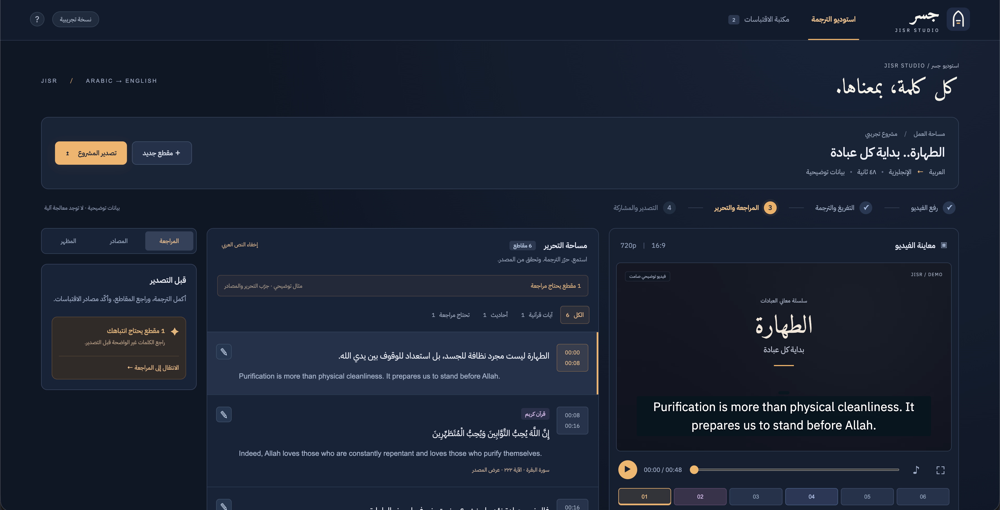

# جسر · Jisr

**Smart studio for translating Arabic Islamic videos into English, with documented Quranic and Hadith citations.**  
منصة ذكية لترجمة الفيديو الإسلامي وتوثيق الآيات القرآنية والأحاديث النبوية.

> Built for the [AI Challenge for Serving Islamic Content](https://islamicaich.org/), October 2026.  
> Jisr is an AI-assisted tool. Private SRT/MP4 drafts can be exported with a review warning. Every matched Quranic or Hadith citation requires human confirmation before sharing through a public viewing link.

**Current status:** The local application integrates **ElevenLabs Scribe v2** for transcription and **OpenAI GPT-6 Luna** for translation, quotation detection, terminology review, independent meaning checks, and source-excerpt alignment. Six real Arabic videos were processed and exported locally with the actual providers. Expert content review and deployment verification of the current release remain necessary before launch. See the [October 5 verification](docs/verification-2026-10-05.md).

The [October 6 product check](docs/verification-2026-10-06.md) verified fresh
local processing, eight current-renderer MP4 exports, browser downloads and a
fresh MP4/SRT workflow on the existing Render host. Automatic Hadith matching
now rejects punctuation-only attribution values. The hosted version is older
than the local release; publish the current fixes before demonstrating its
latest subtitle appearance. Fast cues and unsourced Hadith English remain
explicit human-review tasks.

The [October 4 verification](docs/verification-2026-10-04.md) records 111 passing
Python tests and desktop/mobile browser checks for onboarding, appearance,
upload, review and native MP4 download.



## The problem

Islamic organizations produce valuable Arabic videos, but reaching English-speaking viewers requires transcription, subtitle timing, translation, and manual verification of every quoted verse or Hadith. Transcription errors can slip through, quotations can be translated as ordinary speech, and viewers may receive no traceable sources.

## How it works

1. **Upload** an Arabic video, or open the interactive example.
2. **Transcribe** with Scribe v2 word timestamps. Suspected audio gaps and uncertain speech are flagged for correction.
3. **Translate** ordinary speech with GPT-6 Luna. Word-range validation preserves the transcript and timing; a separate bounded check looks for meaning borrowed from neighboring cues, repetition, ambiguous transcription, and religious terminology errors. Al-Jamhara definitions guide translation of detected Islamic terms. Both automatic translation and its check remain drafts until human review.
4. **Verify Quran quotations** against Quranpedia's Hafs text and attach sourced Saheeh International English. The model does not generate canonical verse translations.
5. **Verify Hadith quotations** against Dorar and search HadeethEnc for a matching translation. Connected quotation parts are retrieved together and keep one source identity. Short search anchors recover records missed by full queries. A unique complete match can be attached automatically; competing narrations appear for comparison. Explanation availability is separate from translation availability. Unverified English remains a labelled machine draft.

Hadith retrieval prioritizes matching the spoken wording over filling metadata: a record with an unspecified narrator stays explicitly incomplete rather than being replaced by a different narration. Conditional wording and pronouns are checked separately from general fuzzy similarity. Long quotations also follow subtitle length limits; existing Arabic/English sentence clauses can be split locally when their counts agree, preserving every timed word and remaining unconfirmed. Otherwise, word-range translation repartitions them before group retrieval. Human edits and approvals are preserved.
6. **Review** source Arabic and English text, timing, narrator, grading, attribution, and subtitle appearance. The editor displays matched Quran/Hadith wording from the reference and keeps the original transcript available for comparison. Saving that wording unchanged preserves the reference; changing quotation text invalidates the link and requires verification again.
7. **Export** a subtitled MP4 or SRT draft with warnings, a JSON list of confirmed citations, or a separate private draft-source inventory with review states and suggestions. The confirmed list is empty before citations are accepted. Public read-only video links require every segment to be reviewed. Exporting a draft does not confirm its text or sources.

For partial quotations, citation details retain the full source while subtitles use the corresponding Arabic and English excerpt. The model can select an exact English substring from the sourced translation; it cannot invent a canonical translation. Uncertain alignment requires manual selection before confirmation and public sharing. A private draft never substitutes an unresolved partial quotation with the full reference.

Source, translation, explanation, and search links are displayed separately. A Dorar direct link is used only when the published record matches the full text and attribution metadata. If no unique record can be resolved, the interface explicitly labels the search fallback.

## Reviewing citations and subtitle source lines

- **Canonical Arabic:** literal Quran/Hadith quotations use the matched source excerpt in the segment list, edit dialog, source cards, and Arabic video preview. When it differs from speech recognition, expand **التفريغ الأصلي** in the edit dialog to compare the original transcript. Partial quotations use their selected excerpt; unresolved excerpts are not replaced by the full reference.
- **Human confirmation:** all unreviewed segments, including ordinary speech, appear in the review filter. A successful machine check never sets human approval. Check wording, meaning, translation, and attribution before selecting **راجعت هذا المقطع**. Unmatched citations remain flagged, with a message distinguishing no match, service unavailability, and an invalid response.
- **Meaning and reading warnings:** ambiguous extraction, duplicated meaning and correction warnings appear beside the affected cue. Reading checks flag English above a local 25 characters/second heuristic or a display shorter than one second. They do not stretch word timings or shorten canonical source translations. Listen and edit these cues before confirming; metrics remain available after confirmation.
- **Retry saved projects:** when the backend reports remaining automatic checks or source work, **إعادة فحص المعنى والمصادر** is available even for a ready project. It reuses saved transcription and completed checks; reviewed text, human translations and custom source captions are protected.
- **Connected Hadith source selection:** use **قارن واربط** to compare complete Arabic/English records, narrator, grade and attribution. For a connected quotation, **تطبيق المرجع على أجزاء الاقتباس المتصل** applies the selected record to the group together. Different wording requires the explicit paraphrase option. Group updates protect reviewed text, human translations and custom source captions.
- **Audience labels:** the automatic Quran caption includes **ترجمة معاني القرآن الكريم** and its translator. Unsourced Hadith English is labelled **English: machine draft** in the preview and exports. Custom or hidden captions remain the editor's responsibility.
- **Hadith paraphrases:** editors can explicitly link a related Hadith as **نقل بالمعنى**. This preserves the speaker's wording and its translation, labels the relationship as a paraphrase, and still requires review before publication.
- **Suggested Hadith sources:** if Dorar cannot match a quotation literally, a bounded HadeethEnc search uses short Arabic anchors. Complete records are checked again; abbreviated wording and recognition differences appear under **مصدر محتمل · قارن واربط**, showing source Arabic, English, narrator, grading, and attribution. These suggestions are not verified literal quotations. Selecting **ربط كنقل بالمعنى** preserves spoken text and leaves human review pending.
- **Readable cues:** the translator aims for short connected clauses and roughly one or two English lines. The server rejects translation parts over 180 English characters, or over 8 seconds when they contain more than 12 Arabic words, including Quran/Hadith parts, and allows one repair attempt. Original word timestamps remain authoritative. Retrying an older project can repair oversized unreviewed speech or Hadith without retranscribing or changing reviewed quotations; failed repair preserves existing translations. Religious quotations also retain their separate source-matching rules.
- **Editable source caption:** select a Quran/Hadith segment, then click **تعديل سطر المصدر** above the video preview, or edit **سطر المصدر أسفل الترجمة** in the segment dialog. Save a custom single-line caption of up to 200 characters, leave it empty to hide the line, or choose **استعادة السطر الأصلي** to restore the automatic label.

Source-caption changes persist after reloading and appear in the preview, MP4, and SRT exports. They preserve the canonical reference, its URL, and existing review decisions; the JSON sources list retains the original source metadata. Replacing or removing a reference clears its custom caption. The shared viewer is read-only.

Automatic video source captions target English-speaking viewers. Quran captions use the chapter name and number, verse number, `Translation of Quranic meanings`, and translator. Chapter names are bundled from [Quran.com](https://api.quran.com/api/v4/chapters?language=en) in `dist/source-caption-labels.json`; no runtime name translation or AI call is required. Hadith captions use English reference labels; complex grading remains available in the original source panel rather than being guessed. Custom captions retain their chosen language. The October 6 check exported a real I5 MP4/SRT and verified the preview image matches the exported cue.


### Preview and MP4 appearance

Real projects use the same server-rendered transparent subtitle image in the browser and MP4, including font, colour, background, line wrapping, Arabic shaping, and source caption. Size 10–42 is measured on a 480-pixel logical video width and scales with the video. Long cues shrink to occupy approximately the lower half of the frame in both views. New uploads default to size 24 for portrait, 22 for square, and 18 for landscape; saved editor settings stay unchanged. Uploaded video keeps its original colours in the preview. The illustrative demo still uses browser text.

MP4 exports use H.264 CRF 18 and preserve normal square-pixel video dimensions. Anamorphic or rotated footage is normalized to its displayed aspect ratio; odd dimensions are rounded up to an even encoding canvas. Compatible audio is copied; other codecs are converted to AAC. Export quality cannot restore detail already absent from the original video. SRT contains text and timestamps; its appearance is controlled by the receiving player. See [export verification](docs/export-rendering.md).

Subtitle transitions hold the current cue until the next starts when the gap is at most 0.5 seconds, consistently in preview, SRT and MP4. Longer silences and the final cue clear normally. Original transcript and source timings remain unchanged. Empty preview text no longer leaves background bars, and the next preview PNG is decoded while warming its cache.

Subtitle images are cached in the browser and the next cue is preloaded. Temporary load failures are retried once; old responses cannot replace the current cue or appear in a timing gap. Saving edits preserves playback position, and appearance saves are serialized before export. The review filter uses the same criteria as public sharing, including unconfirmed references and unresolved partial quotations. JSON citations contain only confirmed, aligned references.

## Project structure

```text
server.py               Standard-library Python HTTP API, AI pipeline, storage, and exports
pipeline_quality.py     Meaning checks, reading warnings, and connected Hadith retrieval
subtitle_png.py         Standard-library PNG alpha bounds for fitting subtitle images
dist/                   Active RTL frontend; no build step
  index.html            App shell
  js/                   Editor, studio, subtitle preview, and citation helpers
  css/                  Editor and responsive styles
  demo.mp4              Silent illustrative demo video
tests/                  Python tests and JavaScript citation-link/text checks
scripts/                Public-source checks and saved citation-link repairs
docs/                   API contract, source policy, implementation notes, and previews
.vscode/                Run, debug, and test configuration
.env.example            Configuration template; contains no credentials
Dockerfile              Linux image with FFmpeg
render.yaml             Free Render demo configuration; temporary storage and idle sleep
compose.yaml            App, Caddy HTTPS proxy, and persistent data volume
Caddyfile               Reverse-proxy configuration
data/                   Generated media and SQLite database; Git-ignored
archive/prototype/      Preserved early frontend and FastAPI prototype
```

The active backend is `server.py`; the archived FastAPI prototype is not the running application. See the [code map](docs/code-map.md) and [API/data contract](docs/data-contract.md).

## Run locally

Requirements: **Python 3.11+** and **FFmpeg with libass and libx264** for video inspection, audio-gap detection, subtitle preview, and MP4 export. No Python package installation or frontend build is needed.

Copy the configuration template:

```bash
# macOS / Linux
cp .env.example .env
```

```powershell
# Windows PowerShell
Copy-Item .env.example .env
```

Add your keys to `.env`:

```dotenv
ELEVENLABS_API_KEY=your_elevenlabs_key
OPENAI_API_KEY=your_openai_key
OPENAI_MODEL=gpt-6-luna
```

The ElevenLabs key must have **Speech to Text** access. If FFmpeg is not in `PATH`, set `FFMPEG_PATH` to its executable in `.env`.

```bash
python server.py
```

Open [http://127.0.0.1:8766](http://127.0.0.1:8766). On systems where Python is named `python3`, use that command instead. Restart the server after changing `.env`.

The interactive demo and manual transcript workflow can be used without AI keys. Automatic processing requires both keys and access to the source services. `/api/health` reports configuration availability; it does not verify credentials, billing, or model access.

In VS Code, select a Python interpreter and use **Run and Debug → JISR: Debug app**. The supplied tasks use `python3` on macOS/Linux and `python` on Windows.

## Sources and services

| Content or task | Source or service |
|---|---|
| Speech and word timestamps | [ElevenLabs Scribe v2](https://elevenlabs.io/docs/api-reference/speech-to-text/convert) |
| Ordinary-speech translation and quotation detection | [OpenAI GPT-6 Luna](https://developers.openai.com/api/docs/models/gpt-6-luna) through the Responses API |
| Quran text | [Quranpedia API](https://quranpedia.net/api-docs), Hafs text |
| English Quran translation | Saheeh International, Quranpedia book ID `1947` |
| Quran explanation, when available | [Dorar tafsir](https://dorar.net/tafseer), preserving section scope and references |
| Hadith attribution and grading candidates | [Dorar](https://dorar.net/hadith) |
| Matched Hadith translation and explanation | [HadeethEnc API](https://github.com/islamhouse-dev/hadith-api) |
| Islamic terminology | [Al-Jamhara dictionary](https://islamic-content.com/dictionary), retrieved for detected terms |
| Subtitle rendering and MP4 export | FFmpeg |

Religious explanations are retrieved from their sources, not generated by the model. Dorar and HadeethEnc metadata remain distinguishable when both are attached. A source's Hadith grade is not an AI confidence score.

See the [source policy](docs/source-policy.md) for the mapping to the challenge's scientific package and remaining source-integration limits, including QuranEnc prioritisation. Third-party services and content have their own licenses and terms. This repository does not bundle religious datasets, model weights, or API credentials; the demo content is illustrative.

## Verification and maintenance

Run the local tests:

```bash
python -m unittest discover -s tests -v
# Optional JavaScript checks; require Node.js
node tests/test_citation_links.js
node tests/test_citation_text.js
node tests/test_subtitle_preview.js
```

The latest subtitle-readability/source-lookup run on Windows passed **177 Python tests**, with **one Unix-only deployment module skipped** and FFmpeg available. External AI and source-service responses are mocked in the suite; no paid API requests are made by these tests. The integration test uploads a video with audio, processes word timestamps and mixed quotations, permits private draft exports, enforces review for public sharing, renders an actual MP4, and checks subtitle/source exports, sharing permissions, retries, and deletion. It also verifies that preview PNG bytes equal the subtitle image used by MP4. Additional cases cover a 10-ms cue in 60-fps video, odd dimensions, rotation/aspect ratio, incomplete cache files, whitespace translations, confirmed-source eligibility, static MIME types, and video byte ranges. Quran boundary regression tests cover split recitations, speaker introductions, repeated recitations, incomplete quotations, source outages, preservation of words/timestamps and reviewed text, transactional translation failures, and the processing pipeline. JavaScript checks cover preview retry, out-of-order responses, timing gaps, cache cleanup, and review decisions. These checks establish local integration rather than live model accuracy.

Citation checks also cover displaying source wording while preserving the original transcript, retaining the reference when saving unchanged displayed Arabic, and keeping partial quotations and paraphrases distinct. Caption tests cover saving, hiding, resetting, input validation, editor access, source replacement, and subtitle output without changing source metadata. The caption workflow was also checked in the browser for saving, persistence after reload, hiding, and restoration.

Optional checks against public citation services:

```bash
python scripts/check_sources.py --output docs/source-check.json
```

This command makes network requests to public sources without sending user videos or invoking paid AI services. The [saved sample report](docs/source-check.json) records successful checks on October 2, 2026; it does not establish corpus-wide matching accuracy.

To repair source links in saved projects:

```bash
python scripts/refresh_source_links.py          # Preview only
python scripts/refresh_source_links.py --apply  # Save resolved links
```

Link repairs preserve transcript text, translations, grades, and review decisions, and do not retranscribe or retranslate videos.

## Privacy and storage

There are **no accounts and no backup system**. Uploaded videos, projects, edits, and exports remain on the server until the editor deletes the project; there is no automatic expiry. Sharing uses a read-only link, while editing requires a separate private link.

Automatic processing sends uploaded media to ElevenLabs and transcript/translation context to OpenAI. OpenAI Responses requests use `store: false`; each provider's own data policies still apply. Public source lookups send relevant quotation or term queries to their services.

Keep API keys and editor links private. `.env`, `data/`, generated logs, and Python caches are excluded by `.gitignore`; only `.env.example` belongs in the repository. Do not force-add private project files when pushing.

## Deployment and remaining work

For the hackathon's public demo, use the [deployment guide](docs/deployment.md).
`render.yaml` prepares a paid, always-on Docker service with HTTPS and persistent
uploads. No public service has been created or verified yet. Generate a clean
runtime-only deployment ZIP with `python3 scripts/package_demo.py`; API keys and
local projects are excluded. Hosting costs require account-owner approval.

For a Linux host with a configured domain, set `JISR_DOMAIN` and the API keys in `.env`, then run:

```bash
docker compose up -d --build
```

Docker, persistent storage, and Caddy HTTPS configuration are supplied. Public deployment has not yet been verified end to end.

Live OpenAI testing translated all nine cues from the saved 53.9-second example using its original 113 word timestamps; Maryam 19:96 received a sourced translation. Three cues still required human review at the time of that check. A separate ElevenLabs test reported missing `speech_to_text` permission; verify the key's access and a fresh upload before relying on automatic transcription. See the [live example receipt](docs/live-example.md).

Before public launch, complete human review of representative Arabic videos, verify live transcription and translation together, and check HTTPS, access links, persistent storage, source retrieval, export, and deletion on the intended host. Citation matching, uncertain speech detection, and machine translation still require editor judgment. The [implementation audit](docs/implementation-status.md) records the outstanding launch checks.

## Team

- **Turki:** frontend, UI/UX, integration, and export.
- **Anas:** AI engineering, translation, and API integration.


Arabic diacritic backdrop fix (October 6): the shared libass renderer uses one padded translucent event box instead of per-run boxes. Combining marks and fallback glyphs no longer create small stepped backdrop edges. The same PNG feeds preview and MP4; disabling the backdrop remains supported. Six font/size cases passed, and an I5 export decoded fully with preview/export cue bytes equal. Renderer `shared-png-v6` invalidates old raster and MP4 caches.
